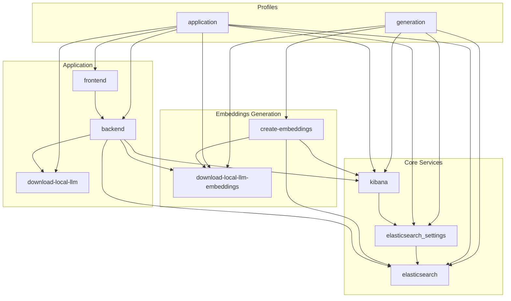

# ObsidianOracle
> 🚧 work in progress

A ChatBot to discuss with your Obsidian Content.

> This project is developed with the Go library [Parakeet](https://github.com/parakeet-nest/parakeet)

## Requirements

- Ollama
- Obsidian
- Docker Compose

## Setup

- Create a `.env` file (see example: `demo.env`)
- Set the `OBSIDIAN_VAULT_PATH` variable
- Set the other variables depending on your needs

## Start

### Create the embeddings and start the application

```bash
docker compose --profile generation --profile application up 
```

### Embeddings generation only

```bash
docker compose --profile generation up 
```

### Start the application only

```bash
docker compose --profile application up 
```

Then open http://localhost:9090/

## Architecture

